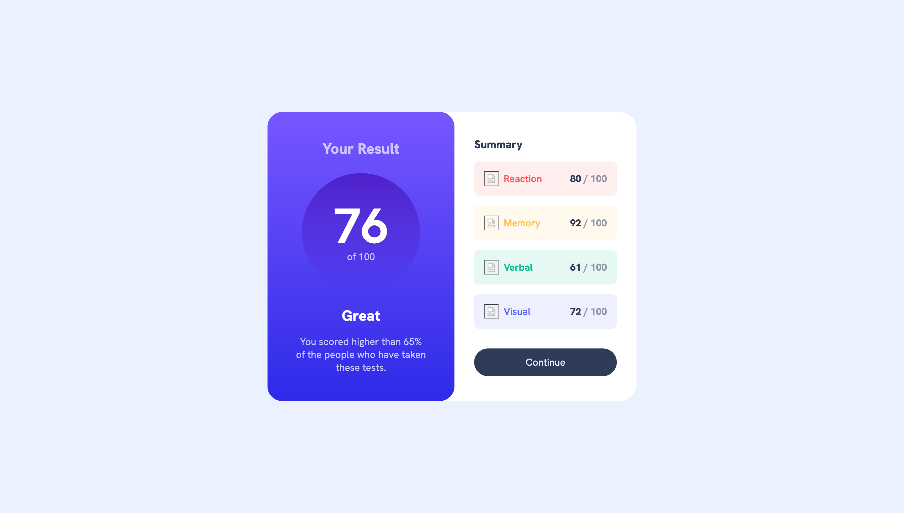

# Frontend Mentor - Results summary component solution

This is a solution to the [Results summary component challenge on Frontend Mentor](https://www.frontendmentor.io/challenges/results-summary-component-CE_K6s0maV). Frontend Mentor challenges help you improve your coding skills by building realistic projects. 

## Table of contents

- [Overview](#overview)
  - [The challenge](#the-challenge)
  - [Screenshot](#screenshot)
  - [Links](#links)
- [My process](#my-process)
  - [Built with](#built-with)
  - [What I learned](#what-i-learned)
  - [Continued development](#continued-development)
  - [Useful resources](#useful-resources)
- [Author](#author)
- [Acknowledgments](#acknowledgments)

## Overview

### The challenge

Users should be able to:

- View the optimal layout for the interface depending on their device's screen size
- See hover and focus states for all interactive elements on the page

### Screenshot



### Links

- Solution URL: [Add solution URL here](https://github.com/ryanthayes/fem-results-summary-component)
- Live Site URL: [Add live site URL here](https://ryanthayes.github.io/fem-results-summary-component)

## My process

After writing the HTML, I used the style guide to define my custom properties. This took some time and is probably overkill for a project this small, but my goal is to always practice like every project, even a component,is not standalone, but part of a bigger project. 

Also, following Kevin Powell's lead from some tutorials of his tht I followed, I styled for mobile on first and then used media queries to adjust CSS for desktop screens. This is a new approach for me and something I still need to work on.

### Built with

- Semantic HTML5 markup
- CSS custom properties
- Flexbox
- Mobile-first workflow

### What I learned

I have been learning a lot from Kevin Powell's videos on YouTube (https://www.youtube.com/@KevinPowell). I have been trying to implement CSS custom properties like he does. Even on small projects like this, pretending they are part of a larger project. With a graphic design background, I really like the idea of using CSS custom properties like a style guide at the top of the stylesheet:

```css
--clr-base-red: 0;
 --clr-accent1: hsla(var(--clr-base-red), 100%, 67%, 100%);
    --clr-accent1-alpha1: hsla(var(--clr-base-red), 100%, 67%, 10%);
```

I also learned about :nth child to style individual <li>. This is very useful. I was able to change the background and font color of each list item without having to create a class for each.

```
css
.summary-item:nth-child(1) .summary-item-title {
  color: var(--clr-accent1)
}
```

### Continued development

As always, how to name things. Grrrr. I have been practicing with flexbox, but is still takes some trial and error to get right. I need to also practice with grids and figure out when it is best to use which.

### Useful resources

- [CSS custom properties with opacity](https://elad.medium.com/why-css-hsl-colors-are-better-83b1e0b6eead) - One of the areas I wanted to practice with is utilizing a design system using CSS custom properties. However, I was unable to apply opacity to CSS custom color property directly. This article gae me an idea of how to break the CSS custom color property into two parts to be able to apply opacity.

## Author

- Github - (https://github.com/ryanthayes)
- Frontend Mentor - (https://www.frontendmentor.io/profile/ryanthayes)